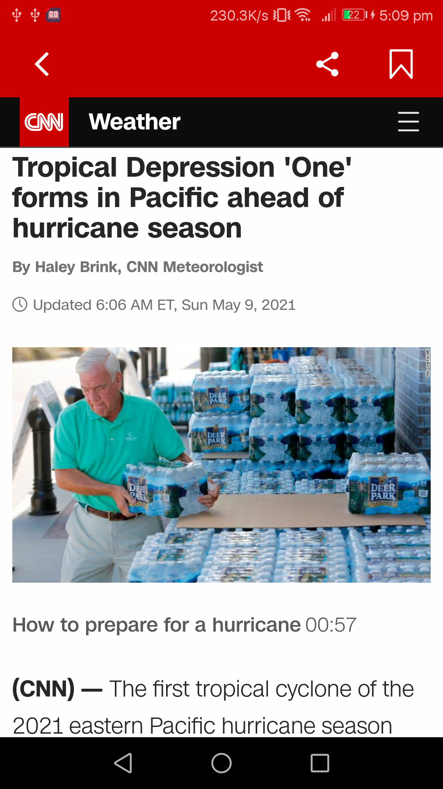
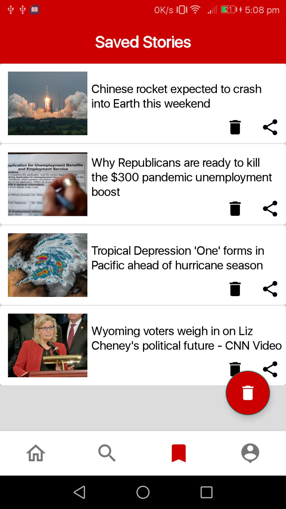
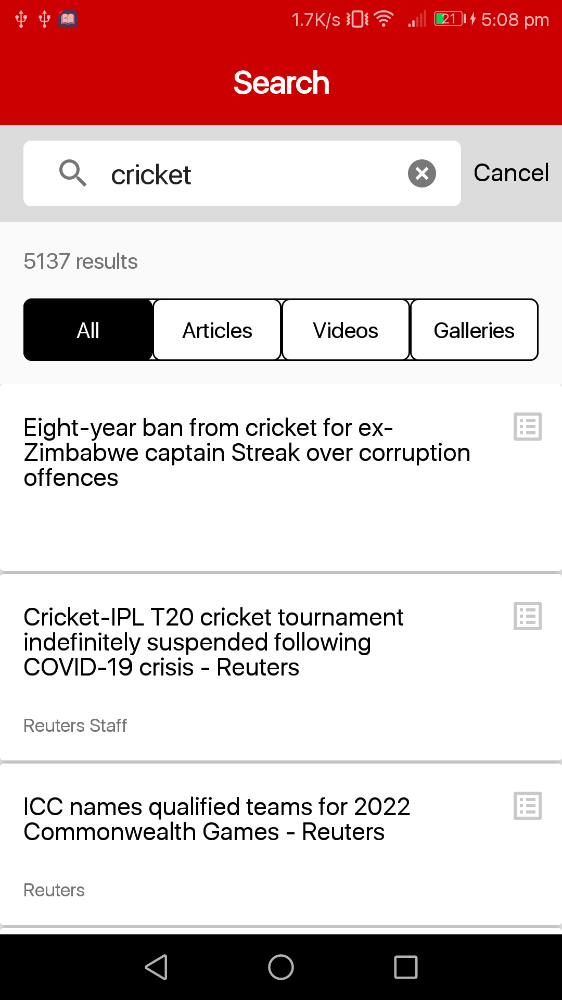
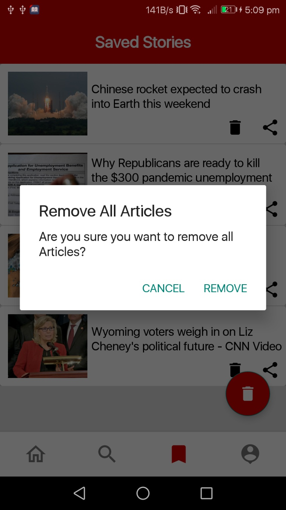
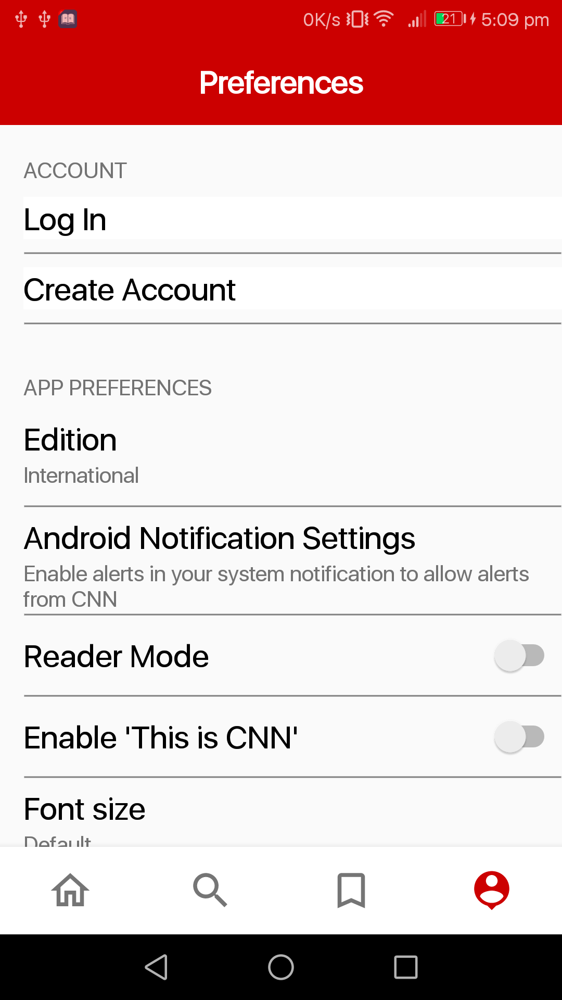
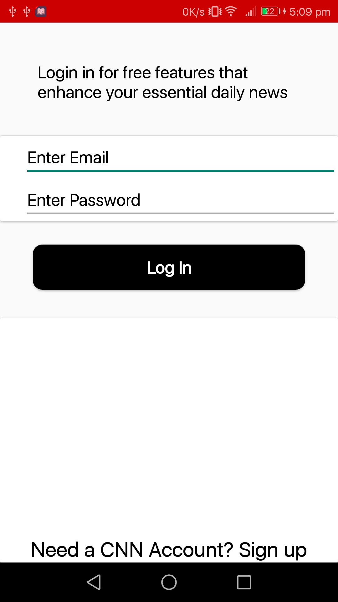
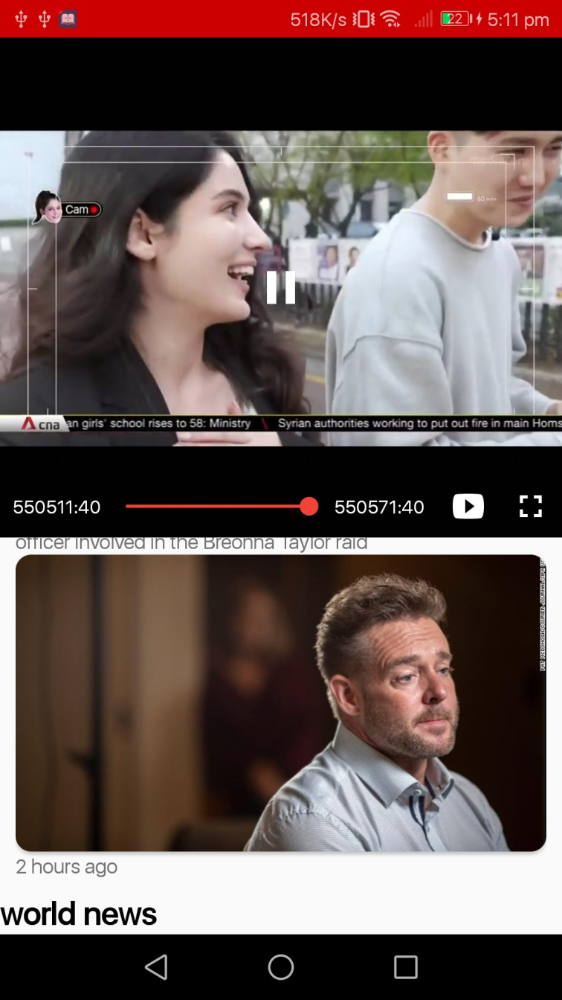

<h1 align="center">CNN App-Clone</h1>

  

  
This is an android demo project based on modern Android application tech-stacks and MVVM architecture. The app simulates the working of the News app, CNN. The app show category wise news and also provide search based news. You can also Save news Articles for future refrence , and also share and like the articles.

  ## App Screenshots

<table>
  <tr>
    <td></td>
    <td></td>
    <td></td>
    <td></td>
  </tr>
  
  <tr>
    <td></td>
    <td></td>
    <td></td>
    <td></td>
  </tr>
 
 </table>

## Libraries & Tech Used
- Minimum SDK level 21
- [Kotlin](https://kotlinlang.org/) based, [Coroutines](https://github.com/Kotlin/kotlinx.coroutines) for asynchronous handling.
- [Hilt](https://dagger.dev/hilt/) for dependency injection.
- JetPack
  - LiveData - notify domain layer data to views.
  - Lifecycle - observing data when lifecycle state changes.
  - ViewModel - lifecycle aware UI related data holder.
  - [Room Database](https://developer.android.com/training/data-storage/room) - for local storage
- Architecture
  - MVVM Architecture (View - ViewModel) 
- [Firebase](https://firebase.google.com/) - for user authentication and realtime database. 
- [Glide](https://github.com/bumptech/glide) - loading images.
- [Navigation Component](https://developer.android.com/jetpack/androidx/releases/navigation) for bottom-bar navigation.
- [Youtube Player](https://developers.google.com/youtube/android/player) for playing trailers
    
